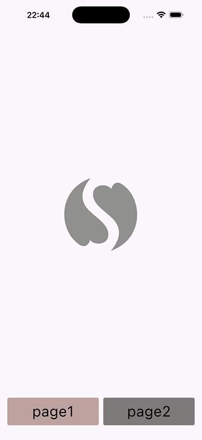

# Test Task

Flutter-приложение с двумя страницами, каунтером и кастомным логотипом, собранным из двух SVG.

## Описание

Приложение состоит из двух экранов с навигацией через нижние кнопки:

- **Page 1** — логотип из двух SVG-половинок. При нажатии половинки поочередно перекрашиваются (левая -> правая -> сброс левой -> сброс правой).
- **Page 2** — счетчик с логотипом. Каждое нажатие на логотип инкрементирует счетчик.

Навигация между страницами реализована через `AutoTabsRouter` — страницы не пересоздаются при переключении, состояние сохраняется.

## Стек

| Технология | Назначение |
|---|---|
| Flutter | UI-фреймворк |
| auto_route | Навигация (tab router) |
| flutter_bloc | Управление состоянием (Cubit) |
| flutter_svg | Рендеринг SVG |

## Структура проекта

```
lib/
  main.dart
  app/router/            — конфигурация роутера
  design/                — палитра цветов
  features/
    home/                — главный экран, навбар
    logo/                — виджет логотипа (2 SVG)
    page1/               — первая страница 
    page2/               — вторая страница 
```

## Запуск

Требования: Flutter SDK, подключенное устройство или эмулятор.

```bash
# Установить зависимости + сгенерировать код + запустить
make run

# Или по отдельности:
make get     # flutter pub get
make gen     # кодогенерация auto_route
make clean   # очистка build-артефактов
```


